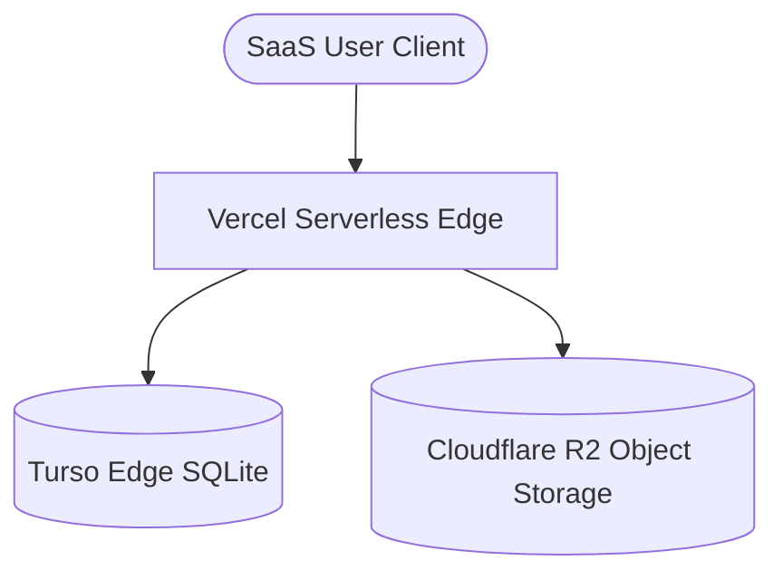

# RJT NEXUS PEOPLE - Persistence Infrastructure

This directory outlines the next-generation, high-performance edge persistence architecture designed for **RJT NEXUS PEOPLE** deploying to Vercel.

---

## 1. PERSISTENCE ARCHITECTURE OVERVIEW

Instead of traditional heavy databases, our architecture is built for ultra-low latency, decentralized edge execution:

### 1. Relational Database: Turso (Edge SQLite)
* **Description**: Built on `libsql` (an open-contribution fork of SQLite), Turso replicates relational database replicas directly to edge locations closest to Vercel serverless functions.
* **Why SQLite at the Edge**:
  * Near-zero connection overhead (instant wakeups).
  * Direct localized replication for global performance.
  * Simple, robust relational schemas using native standard SQL.

### 2. Object & File Storage: Cloudflare R2
* **Description**: High-performance, S3-compatible object storage with **zero egress fee charges**.
* **Why Cloudflare R2**:
  * Perfect for caching evidence PDFs, raw batch files, and manual templates.
  * Zero egress fees means scale operations incur no network bandwidth penalties.
  * Signed upload URLs keep files secure and private.

### 3. Execution & Routing Target: Vercel
* **Description**: Orchestrates the serverless API routes connecting the client and edge nodes.

---

## 2. STRUCTURAL PERSISTENCE SEGREGATION

### 1. Relational Tables (Turso)
Maintains high-integrity relational links, indexes, and constraints:
* `tenants` - Top-level organization partitioning.
* `employees` - Corporate personnel registers and skill arrays.
* `organization_units` - Sectors, departments, and cost center branches.
* `functions` - Critical functional roles.
* `employee_assignments` - Dynamic allocations linking staff to functions.
* `critical_function_assessments` - GUT scores and exposure snapshots.
* `backup_assignments` - Validated, proposed, and in-training backups.
* `succession_candidates` - Readiness pipelines.
* `training_programs` - Theoretical certification mappings.
* `ojt_plans` - Practical on-the-job plans.
* `knowledge_assets` - SOP documentation registers.
* `evidence_records` - Uploaded compliance proofs.
* `action_plans` - Corrective PDCA tasks.
* `import_batches` - Batch import transactions history.
* `import_errors` / `import_warnings` - Diagnostic logs linked to batches.

### 2. Object Keys (Cloudflare R2)
Stored in isolated tenant prefixes inside Cloudflare buckets:
* `/imports/:tenantId/:batchId.csv` - Original parsed upload sheets.
* `/evidence/:tenantId/:employeeId/:evidenceId.pdf` - ISO compliance proofs.
* `/assets/:tenantId/:assetId.pdf` - SOP and corporate manuals.
* `/certificates/:tenantId/:employeeId/:trainingId.pdf` - Training records.
